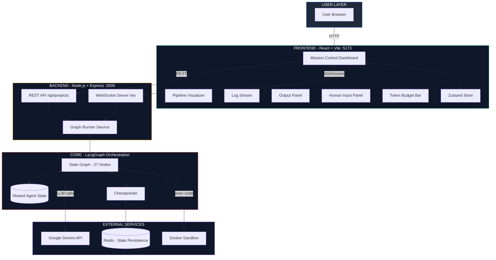
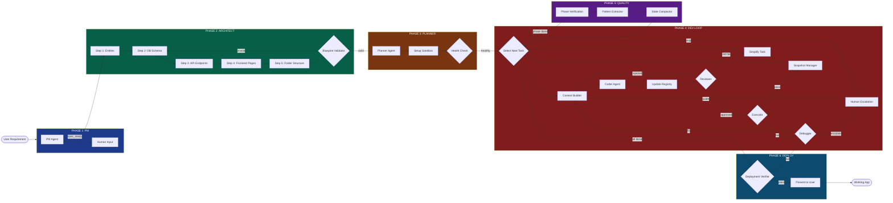
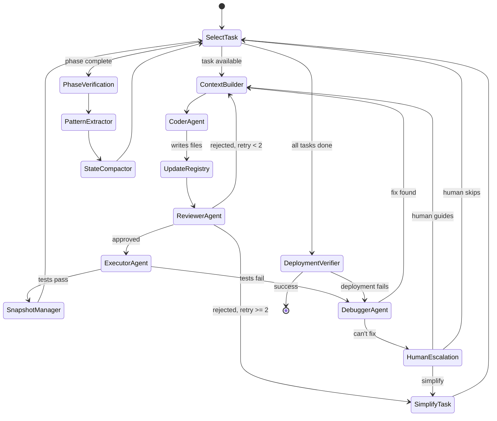
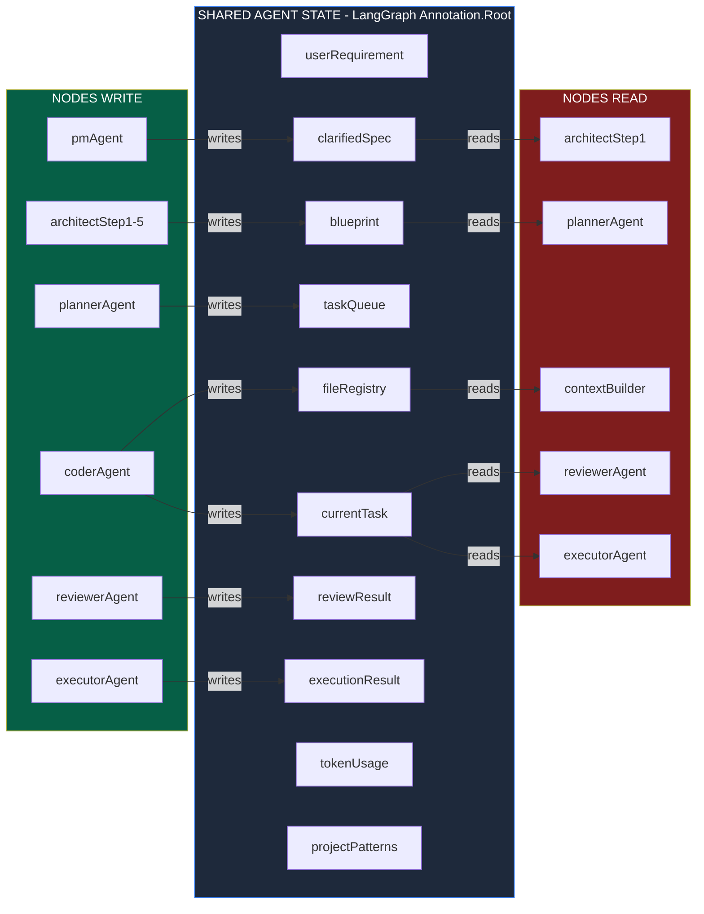
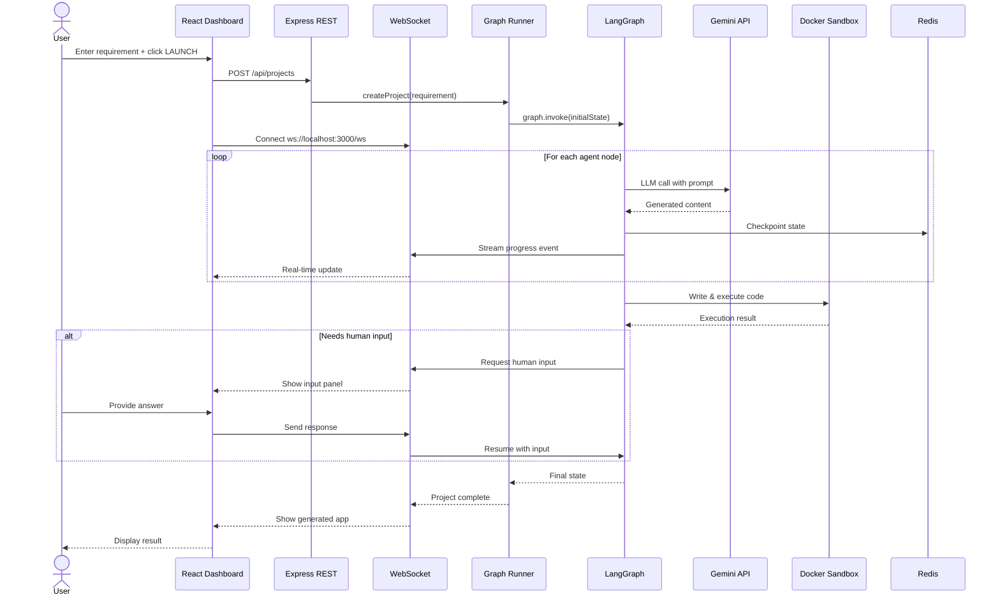
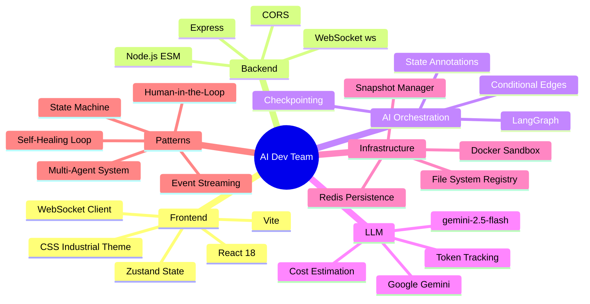

# AI Dev Team — System Architecture

A multi-agent autonomous software development system. Takes a plain-English requirement and produces a working application through 27 specialized AI agents orchestrated by LangGraph.

---

## 1. High-Level System Architecture

---

## 2. The 7-Phase Pipeline (End-to-End Flow)

---

## 3. The Dev Loop — Self-Healing Mechanism (Phase 4 Detail)

---

## 4. State Communication Model

---

## 5. Request Flow: From Browser Click to Code Generation

---

## 6. Technology Stack

---

## Key Architectural Decisions

| Decision | Why |
|----------|-----|
| **LangGraph over plain function calls** | State-driven communication scales to 27 nodes without spaghetti code. Conditional edges handle retries/branching cleanly. |
| **Shared state with reducers** | Nodes are pure — they read state, return updates. Reducers handle merging (arrays accumulate, objects merge, scalars overwrite). |
| **Checkpointing after every node** | Long pipelines (sometimes 30+ minutes) can crash. Resume from last good state instead of restarting. |
| **Docker sandbox for code execution** | Generated code is untrusted. Isolation prevents host system damage. |
| **WebSocket for dashboard** | Long-running pipeline needs push-based updates. Polling would miss events and waste resources. |
| **Token budget enforcement** | LLM calls cost money. Hard limit prevents runaway costs from infinite loops. |
| **Pattern extraction phase** | Without it, each task generates code in a different style. Extracting patterns keeps the codebase consistent. |
